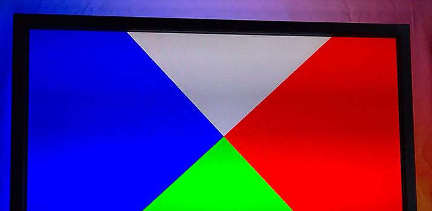
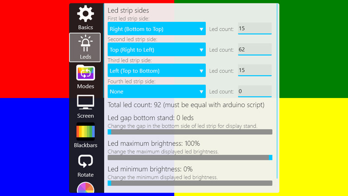

## Application Description
Arduino adalight, fastled backlight easy and low resource screen capturer,
this application will capture your screen and sync the colors to your led strip.
- This is a beta test release so things may not always work properly.

## Application Features
- Optimized for fullscreen performance gaming.
- Automatically adapt to displayed content blackbars.
- Easily calibrate your led strip in the application.
- HDR content gets converted to SDR for accurate led colors.
- Frame smoothing for reduced flickering during fast motion.
- Switch between screen capture and several color modes.
- Control the leds on another device with the remote.

## Installation Instructions
1) Extract the AmbiPro folder to any directory you want on your device.
2) Make sure that you have installed all the requirements listed below.
3) Run the Launcher executable file and setup your Arduino in the settings.
4) Enjoy using your Arduino ambilight setup with AmbiPro.

## Uninstallation Instructions
1) Remove the created shortcuts from your startup folder.
2) Remove the created tasks in Windows task scheduler.
3) Remove the extracted AmbiPro directory.

## Tips and tricks
- Let AmbiPro automatically launch on Windows startup for easier all time usage.
- Some users may need to run the application as administrator to let it work properly.*
- For more information and help open the "Help" window or tab in the application.
* You can run it as administrator by using the "AmbiPro-Admin" executable.

## Requirements
- Microsoft Visual C++ Redistributable installed.
- Windows operating system 10 64-bit or higher is required.
- A DirectX 12 or higher capable graphics adapter.

## Known Issues
- Some content with HDR or DRM might not be captured and show as turned off leds.

## Support and bug reporting
When you are walking into any problems or a bug you can go to my help page at https://help.arnoldvink.com so I can try to help you out and get everything working.

## Developer donation
If you appreciate my project and want to support me with my projects you can make a donation through https://donation.arnoldvink.com

## Changelog
v0.23.0.0 (23-January-2023)
- Added HDR capture brightness setting.

v0.22.0.0 (8-November-2022)
- Added led strip energy saving mode setting.

v0.12.0.0 (8-April-2022)
- Added screen capture HDR to SDR tonemapping.

v0.11.2.0 (18-October-2021)
- You can now change the solid led color with the remote.

v0.11.0.0 (17-June-2021)
- Added led smoothing setting.
- Added color temperature setting.

v0.10.0.0 (13-May-2021)
- Rewrote screen color capture code to reduce cpu usage and fill in gaps.
- Changed the way led count and sides are setup for more flexibility.
- Added AmbiPro administrator launcher.

v0.9.4.5 (22-January-2018)
- The color spectrum mode now rotates it's colors.

v0.9.4.0 (13-December-2017)
- Added solid color and color loop switch modes.

v0.9.1.0 (8-November-2017)
- Added Remote control support to the application.

v0.9.0.0 (5-November-2017)
- First official beta test release.